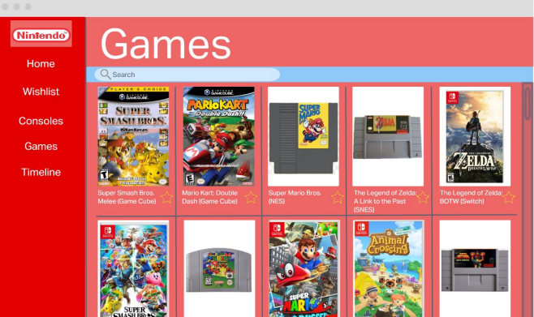

# NintendoInventory
### Created by: Emily Morgan, Cierra Citizen, Alejandra Hernandez
 

**Description:**  
A web-based application that allows a user to 
search through various Nintendo consoles or 
games and add them to a wishlist. 
Nintendo is a video game company that has 
at least 7 different gaming consoles and over 
4000 games. 
We do not plan on listing ALL of those 
games. Only a select number of games from 
each console will be used in our application.

**Pages:**  
- Home Page
  - Homepage of the web application
- Wishlist
  - Users can add, remove, and edit their wishlist
- Games
  - Users can search and view nintendo games
- Consoles
  - Users can search and view nintendo game consoles
- Timeline 
  - Users can view the history and timeline of Nintendo and other interesting facts

 

